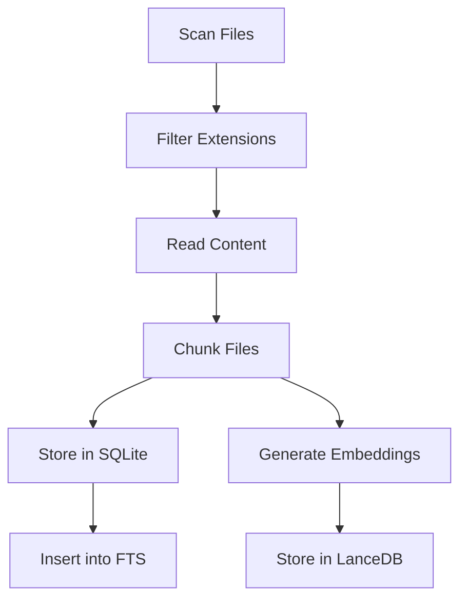
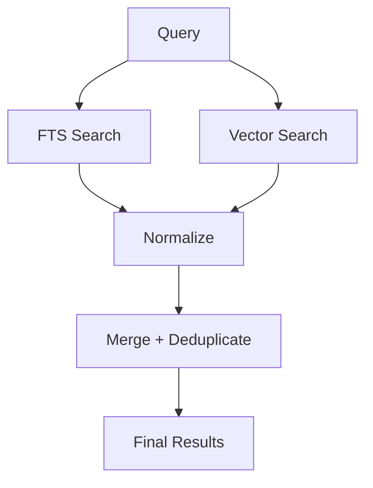

# Psydecar POC — Implementation Spec

## 1. Overview

Build a local-first psydecar system that allows an agent to search and read from one or more indexed local directories (sidecars).

- Each sidecar = indexed directory of code/text files
- Agents connect via MCP (stdio) to query sidecars
- Fully local: no cloud dependencies

---

## 2. Core Concepts

```mermaid
flowchart TD
    A[Local Filesystem] --> B[Sidecar Indexing]
    B --> C[SQLite FTS]
    B --> D[LanceDB Vectors]

    E[Angular Dashboard] --> F[FastAPI Backend]
    F --> B

    G[Agent Client] --> H[MCP Server (stdio)]
    H --> C
    H --> D
```

---

## 3. Goals

### Primary

- Local-only system
- Multiple sidecars
- Hybrid search (keyword + semantic)
- Dashboard UI
- MCP integration
- Incremental refresh + auto-watch

### Out of Scope (POC)

- PDFs/images
- AST parsing
- Reranking models
- Auth/multi-user
- Cloud services

---

## 4. Tech Stack

Backend:

- Python
- FastAPI
- SQLite (FTS5)
- LanceDB
- sentence-transformers
- watchdog

Frontend:

- Angular 21 (standalone)

Agent Interface:

- MCP Python SDK (stdio)

Embeddings:

- BAAI/bge-small-en-v1.5

---

## 5. Storage Layout

~/.psydecar/
sidecars/
<id>/
sidecar.json
index.sqlite
vectors.lance/
manifest.json

---

## 6. Data Model

Documents:

- id
- relative_path
- extension
- size_bytes
- modified_at
- content_hash
- status

Chunks:

- id
- document_id
- relative_path
- start_line
- end_line
- text
- content_hash

---

## 7. Chunking Strategy

- Markdown: split by headings
- Code/Text: ~140 lines, 20 overlap
- JSON/YAML: line-based

---

## 8. Indexing Flow



---

## 9. Refresh Strategy

Incremental:

- detect new/modified/deleted files
- update only affected chunks

Rebuild:

- delete index
- re-ingest everything

---

## 10. File Watching

- watchdog
- debounce 1–2 seconds
- batch updates

---

## 11. Search Design

Modes:

- keyword
- semantic
- hybrid (default)



---

## 12. MCP Server

Command:

psydecar mcp --sidecars frontend,backend

Tools:

- search
- read_chunk
- read_file
- list_files
- get_status

---

## 13. Backend API

- GET /api/sidecars
- POST /api/sidecars
- DELETE /api/sidecars/{id}
- POST /api/sidecars/{id}/refresh
- POST /api/sidecars/{id}/rebuild
- GET /api/sidecars/{id}/files
- GET /api/sidecars/{id}/errors
- GET /api/sidecars/{id}/mcp-config

---

## 14. Dashboard Features

- Sidecar list
- Create sidecar
- Status view
- File list
- Error list
- MCP config copy
- Search preview

---

## 15. Security

- Restrict file access to sidecar root
- Prevent path traversal
- No write/delete via MCP
- Enforce max file size
- Skip binary files

---

## 16. Performance Targets

- 100–2000 files
- 1k–20k chunks
- search < 1s

---

## 17. Milestones

1. Indexing + FTS
2. Embeddings + vector search
3. Hybrid search
4. MCP server
5. FastAPI backend
6. Angular dashboard
7. File watching

---

## 18. Acceptance Criteria

- Create sidecar
- Index files
- Search works
- MCP works
- Dashboard works
- Runs fully local
